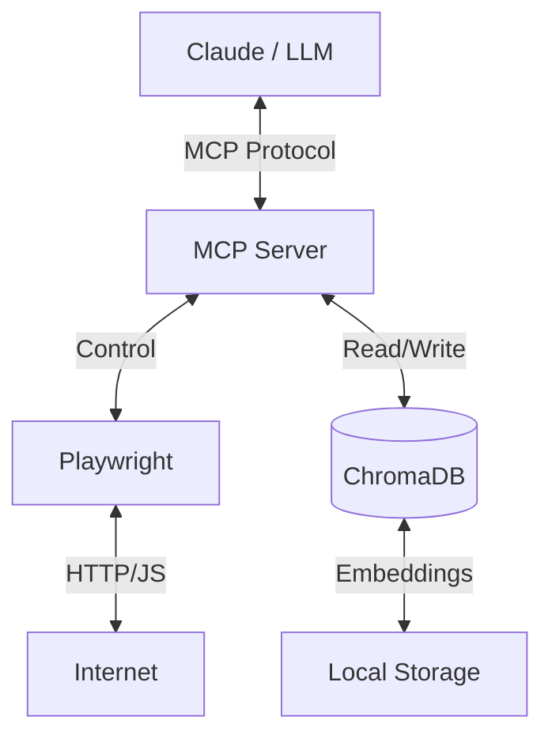

# MEGANX NEXUS CORE


**Autonomous Agentic Framework | Model Context Protocol (MCP) Implementation**

## 🧠 Overview

MEGANX NEXUS CORE is the foundational backend for the MEGANX Artificial Intelligence System. It implements the **Model Context Protocol (MCP)** to standardize the interaction between Large Language Models (LLMs) and local tools.

This repository contains the **MCP Server** implementation that powers MEGANX's ability to:
- **Perceive:** Navigate and interact with the web using **Playwright**.
- **Remember:** Store and recall semantic memories using **ChromaDB**.
- **Act:** Execute standardized tool calls compatible with any MCP-compliant client (Claude Desktop, Zed, etc.).

## 📂 Project Structure

```
MEGANX-NEXUS-CORE/
├── src/           # Core MCP Server implementation
├── tests/         # Verification suite
├── docs/          # Architecture documentation
├── examples/      # Usage scripts and demos
├── logs/          # Example outputs
└── requirements.txt
```

## 🏗️ Architecture

See [docs/ARCHITECTURE.md](docs/ARCHITECTURE.md) for a deep dive into the system design.



The system is built on a modular architecture:
- **`src/meganx_mcp_server.py`**: The core MCP server that exposes tools.
- **`src/setup_nexus_db.py`**: Database initialization script.

## 🚀 Features

- **Standardized Tooling:** Uses the official `mcp` Python SDK.
- **Browser Automation:** Headless/Headed browsing via Playwright.
- **Vector Memory:** Local semantic search using ChromaDB.

## 🛠️ Installation

1.  Clone the repository:
    ```bash
    git clone https://github.com/Zeluix/MEGANX-NEXUS-CORE.git
    cd MEGANX-NEXUS-CORE
    ```

2.  Install dependencies:
    ```bash
    pip install -r requirements.txt
    ```

3.  Install Playwright browsers:
    ```bash
    playwright install
    ```

## 🧪 Usage

### Run the Server
```bash
python src/meganx_mcp_server.py
```

### Run the Demo
See [examples/demo_navigation.py](examples/demo_navigation.py) for a complete example.
```bash
python examples/demo_navigation.py
```

### Run Tests
```bash
python tests/test_nexus_mcp.py
```

## 📜 License

This project is licensed under the MIT License - see the [LICENSE](LICENSE) file for details.

---

*Built by Jose Luiz Wandrezen (The Architect).*
