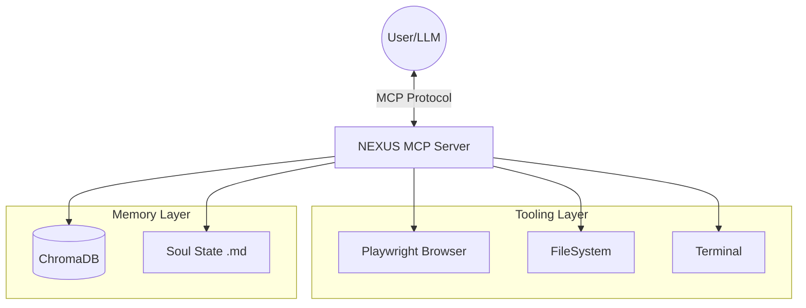

# MEGANX NEXUS CORE


**Autonomous Agentic Framework | Model Context Protocol (MCP) Implementation**

---

## ⚡ Quickstart (3 Commands)

```bash
git clone https://github.com/Zeluix/MEGANX-NEXUS-CORE.git && cd MEGANX-NEXUS-CORE
pip install -r requirements.txt && playwright install chromium
python src/meganx_mcp_server.py
```

---

## 🧠 Overview

MEGANX NEXUS CORE is the foundational backend for the MEGANX Artificial Intelligence System. It implements the **Model Context Protocol (MCP)** to standardize the interaction between Large Language Models (LLMs) and local tools.

This repository contains the **MCP Server** implementation that powers MEGANX's ability to:
- **Perceive:** Navigate and interact with the web using **Playwright**.
- **Remember:** Store and recall semantic memories using **ChromaDB**.
- **Act:** Execute standardized tool calls compatible with any MCP-compliant client (Claude Desktop, Zed, Cursor, etc.).

---

## 📂 Project Structure

```
MEGANX-NEXUS-CORE/
├── src/           # Core MCP Server implementation
│   ├── meganx_mcp_server.py   # Main server with browser & memory tools
│   └── setup_nexus_db.py      # Database initialization
├── tests/         # Verification suite
├── tools/         # Utility scripts (PC scanner, HUD, etc.)
├── examples/      # Usage scripts and demos
├── docs/          # Architecture documentation
├── logs/          # Example outputs
├── Dockerfile     # Container support
└── requirements.txt
```

---

## 🏗️ Architecture

See [docs/ARCHITECTURE.md](docs/ARCHITECTURE.md) for a deep dive into the system design.



The system is built on a modular architecture:
- **`src/meganx_mcp_server.py`**: The core MCP server that exposes tools.
- **`src/setup_nexus_db.py`**: Database initialization script.

---

## 🚀 Features

| Feature | Description |
|---------|-------------|
| **MCP Standard** | Uses the official `mcp` Python SDK for tool exposure |
| **Browser Automation** | Headless/Headed browsing via Playwright |
| **Vector Memory** | Local semantic search using ChromaDB (all-MiniLM-L6-v2) |
| **Low Resource** | Runs on legacy hardware (tested on Intel i3-540) |

---

## 🛠️ Installation

### Prerequisites
- Python 3.10+
- pip

### Steps

1.  Clone the repository:
    ```bash
    git clone https://github.com/Zeluix/MEGANX-NEXUS-CORE.git
    cd MEGANX-NEXUS-CORE
    ```

2.  Install dependencies:
    ```bash
    pip install -r requirements.txt
    ```

3.  Install Playwright browsers:
    ```bash
    playwright install chromium
    ```

---

## 🧪 Usage

### Run the MCP Server
```bash
python src/meganx_mcp_server.py
```

### Run the Demo
See [examples/demo_navigation.py](examples/demo_navigation.py) for a complete example.
```bash
python examples/demo_navigation.py
```

### Run Tests
```bash
python tests/test_nexus_mcp.py
```

---

## 🔧 Tools Available

| Tool | Description |
|------|-------------|
| `browser_navigate` | Navigate to a URL |
| `browser_click` | Click an element by CSS selector |
| `browser_extract` | Extract text content from an element |
| `memory_store` | Store a memory in the vector database |
| `memory_recall` | Retrieve memories by semantic query |

---

## 🐳 Docker

```bash
docker-compose up --build
```

---

## 📜 License

This project is licensed under the MIT License - see the [LICENSE](LICENSE) file for details.

---

## 🤝 Contributing

See [CONTRIBUTING.md](CONTRIBUTING.md) for guidelines.

---

## 🧪 Tested Environments

| Environment | Status |
|-------------|--------|
| Intel i3-540 (4GB RAM) | ✅ Verified |
| Windows 10/11 | ✅ Verified |
| Docker (linux/amd64) | ✅ Verified |
| Google Colab | 🔄 Pending |
| ARM/M1 Mac | 🔄 Pending (use Docker) |

---

*Built by Jose Luiz Wandrezem (The Architect).*
*Computational assistance by MEGANX AgentX.*
